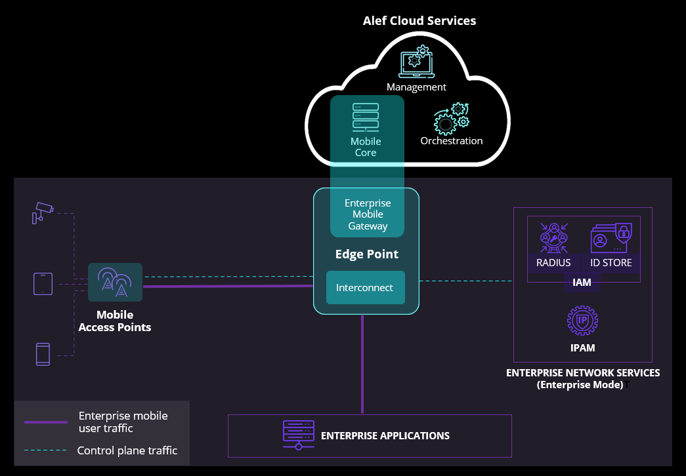

# The Alef Private Mobile Network

## Terminology

**Mobile Core:** Provides core session and mobility management functionalities for mobile networks.

**Edge Point:** A node in customer network where customer’s Alef services are running. The Edge Point can run either at a Customer or Alef location.

**Edge Point Location:** The location where the Edge Point is deployed, which can be an Alef Location or Customer Location.

**Mobile Gateway:**  A software service presented at the customers dedicated Edge Point that provides mobile functionality. We offer two Mobile Gateway options:

- **Enterprise Mobile Gateway (EMG)** -  a hybrid mobile core instance where mobile access control is delivered by existing enterprise IT systems.
- **Classic Mobile Gateway (CMG)** - A ‘classic’ full mobile core with its own standard mobile access control functions.

**Interconnect:** Service at the Edge Point that connects services such as the Mobile Gateway to the customer network, this can be L2, L2.5 (MPLS) or L3.

**Site:** A customer facility with a RAN served by Mobile Gateway(s) running at an Edge Point.

**UEs:** Mobile devices (UE stands for ‘User Equipment’, and is a legacy term that is still commonly used in mobile networking).

**SAS:** Spectrum Access System, required for private mobile networks in the US.

## Summary

The Alef Edge Platform is a Private Mobile Network (PMN) that allows enterprises to create, connect to, and manage private mobile networks within enterprise IT to securely and seamlessly run their business workflows over a private mobile network either on or off prem via Alef “Edge Points”.

This is achieved without the dependency on mobile network operators and the knowledge of the intricacies of mobile system specifications. 

The Alef PMN offers two different Mobile Gateway options, according to customer requirements:

**Enterprise Mobile Gateway** 

To simplify adoption by enterprise network teams, the Enterprise Mobile Gateway fits into network architecture in a similar way to a wifi controller, as enterprises can:

- Use their existing IAM for mobile endpoint access control via RADIUS
- Use their existing IPAM for mobile endpoint IP address allocation 
- Choose their mobile APs, and manage them via the Alef platform
- Present mobile traffic either onsite or offsite according to requirements

**Classic Mobile Gateway**

For customers who are used to working with mobile technologies and wish to run their mobile network with a full ‘classic’ mobile core. When using the Classic Mobile Gateway, all access control is handled directly on the mobile core. Therefore, the Classic Mobile Gateway enables a customer to:

- Choose their mobile APs, and manage them via the Alef platform
- Present mobile traffic either onsite or offsite according to requirements

## Architecture

### Edge Point​

The Edge point is an Alef Private Mobile network Point of Presence (POP) for a given customer, and is where customer mobile traffic is presented. A customer can have multiple Edge Points, which can be located in a colo facility to maximize cost efficiency or on customer premises for enhanced security and site survivability.

The Edge Point includes two elements: 

- The **Mobile Gateway** that provides the private mobile network functionality, such as session registration, mobility handoff and session management signaling. It consists of the cloud based mobile core and services running locally on your Edge Point, including the high performance UPF that presents mobile traffic locally at the Edge Point.  The Classic Mobile Gateway also handles device authorization and authentication, whereas the Enterprise Mobile Gateway hands this off to the customer IAM. 
- The **Interconnect** which provides connectivity between the Mobile Gateway and the enterprise network. 

These elements work together to provide:

- **Seamless mobility within a mobile network**, achieved by keeping a mobile device’s data session anchored to a fixed PDN Gateway (PGW) while the mobile device roams between mobile APs. Alef Connect provides PGW functions at the Edge point, anchoring the mobile device’s continuous data session, hence improving the connectivity experience as the device moves around.
- **Mobile traffic where you need it**, as the mobile device’s original IP packets are presented on the wire at the Edge Point.

### Enterprise Mobile Gateway

The Enterprise Mobile Gateway (EMG) uses the customers existing IAM for authentication and authorization. Also, the customers IPAM can be used for IP address allocation.

<b>Fig 1: Alef Private Mobile Network - Enterprise Mobile Gateway</b>

 

When a mobile device is successfully authenticated and authorized by your IAM:

- The EMG will be instructed to bring up the mobile session.
- The EMG will assign an IP address to the mobile device from your IPAM. It will be possible to set an attribute in the authorization profile to specify which IP pool on the IPAM this IP address comes from.
- Authorization profile will be applied to traffic from the mobile device ingressing the enterprise network from the EMG.
- User traffic will flow from the mobile device to your mobile applications (and vice versa) via the EMG.

When setting up your mobile network, you will use the Alef Management services to carry out the following tasks:

1. Create a Mobile Gateway. Elements of the Mobile Gateway, such as the mobile core will be provisioned automatically by the Alef Orchestration services
2. Once connectivity to your Edge Point location has been set up, create an Edge Point. The Edge Point will be provisioned automatically by the Alef Orchestration services.
3. Provision your mobile Access Points. They will use the TR-069 device management protocol to communicate with the Edge Point’s Automatic Configuration Service. 

Finally, you will import your SIM ID information and Alef’s LDAP schema into your ID store, and configure your RADIUS policy. It will then be possible to control the network access required for each mobile device according to the SIM it is using.

### Classic Mobile Gateway

If you are familiar with mobile core technologies, and wish to use a mobile core with its own ID store and policy management engine, then you will use the Alef Classic Mobile Gateway (CMG).

Just like the EMG, the CMG offers you the ability to present mobile traffic either onsite or offsite via the Edge Point, and can manage your mobile APs. The difference is that the mobile core will behave like a ‘classic’ mobile core, using its own internal authentication and authorization functions for SIM auth instead of using an external IAM.

You will use the Alef Management services to carry out the following tasks:

1. Create a Mobile Gateway. Elements of the Mobile Gateway, such as the mobile core will be provisioned automatically by the Alef Orchestration services
2. Once connectivity to your Edge Point location has been set up, create an Edge Point. The Edge Point will be provisioned automatically by the Alef Orchestration services.
3. Provision your mobile Access Points. They will use the TR-069 device management protocol to communicate with the Automatic Configuration Service running on the Edge Point. 
4. Provision your SIMs in the mobile core

User traffic will flow from the mobile device to your mobile applications (and vice versa) via the CMG.

